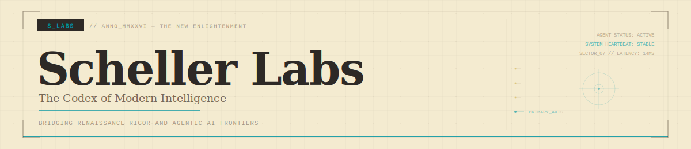

  

 

  
  &nbsp;
  
  &nbsp;
  
  &nbsp;
  

---

> *"The noblest pleasure is the joy of understanding."*

**Scheller Labs** is a research organization operating at the boundary of intellectual rigor and frontier AI. We function as a modern-day codex — a living workspace where technical architectures, exploratory agent systems, and documented knowledge coexist.

Our operating principle is **The New Enlightenment**: applying the scholarly discipline of the Renaissance to the open problems of agentic machine intelligence, precision biosensing, and autonomous systems.

---

## `RESEARCH_DOMAINS`

<table>
<thead>
<tr>
<th align="left"><code>DOMAIN</code></th>
<th align="left"><code>FOCUS</code></th>
<th align="center"><code>STATUS</code></th>
</tr>
</thead>
<tbody>
<tr>
<td><strong>Agentic AI Systems</strong></td>
<td>Multi-agent orchestration, swarm coordination, LangGraph + AutoGen architectures</td>
<td align="center"></td>
</tr>
<tr>
<td><strong>Precision Biosensing</strong></td>
<td>ML-based physiological monitoring, edge inference, IoT sensor fusion</td>
<td align="center"></td>
</tr>
<tr>
<td><strong>Quantitative Systems</strong></td>
<td>Algorithmic strategy development, backtesting frameworks, real-time execution</td>
<td align="center"></td>
</tr>
<tr>
<td><strong>Edge AI & Inference</strong></td>
<td>Local model serving, GPU cluster orchestration, vLLM deployments</td>
<td align="center"></td>
</tr>
</tbody>
</table>

---

## `SELECTED_TREATISES`

<strong><code>[ VOL_01 ] — The Codex</code></strong> &nbsp; 

 

A living repository of documentation, mapping the neural architectures and symbolic logic used across the S_LABS ecosystem. The Codex provides the epistemic foundation for all research conducted under this organization — structured as both reference material and exploratory sketchbook.

<strong><code>[ VOL_02 ] — Agentic Methodology</code></strong> &nbsp; 

 

The framework for autonomous agent swarms, focusing on collaborative problem-solving and emergent behavior. Core research into coordination protocols, Strategy Registry FSMs, and deterministic real-time execution pipelines.

<strong><code>[ VOL_03 ] — Precision Sensing</code></strong> &nbsp; 

 

ML-based biosensor systems for physiological monitoring at scale. Research spans edge inference architectures, anomaly detection models, and global deployment patterns across heterogeneous IoT environments.

---

## `PROTOCOL_STACK`

  
  
  
  
  
  
  
  
  

---

  

 

  <code>© 1502—2026 Scheller Labs. The New Enlightenment. &nbsp;|&nbsp; SYSTEM_HEARTBEAT: STABLE &nbsp;|&nbsp; SECTOR_07 // LATENCY: 14MS</code>

